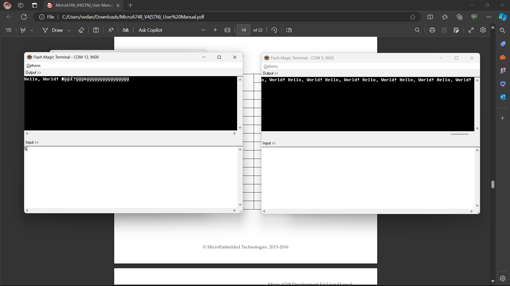

# Lifi-data-transfer
Li-Fi data transfer using arm based microcontroller lpc2148.

Basic idea of this project is transfering a string of "Hello world" between two lpc2148 kits, using laser and a photodiode in place of the physical UART connection, to demonstrate that laser can be used as an alternative wireless data transfer mechanism (Li-Fi).

This repository contains the keil project files of the project along with the hex files for receiver and transmitter which can be flashed onto the lpc2148 kits.

# Screenshot
------------

